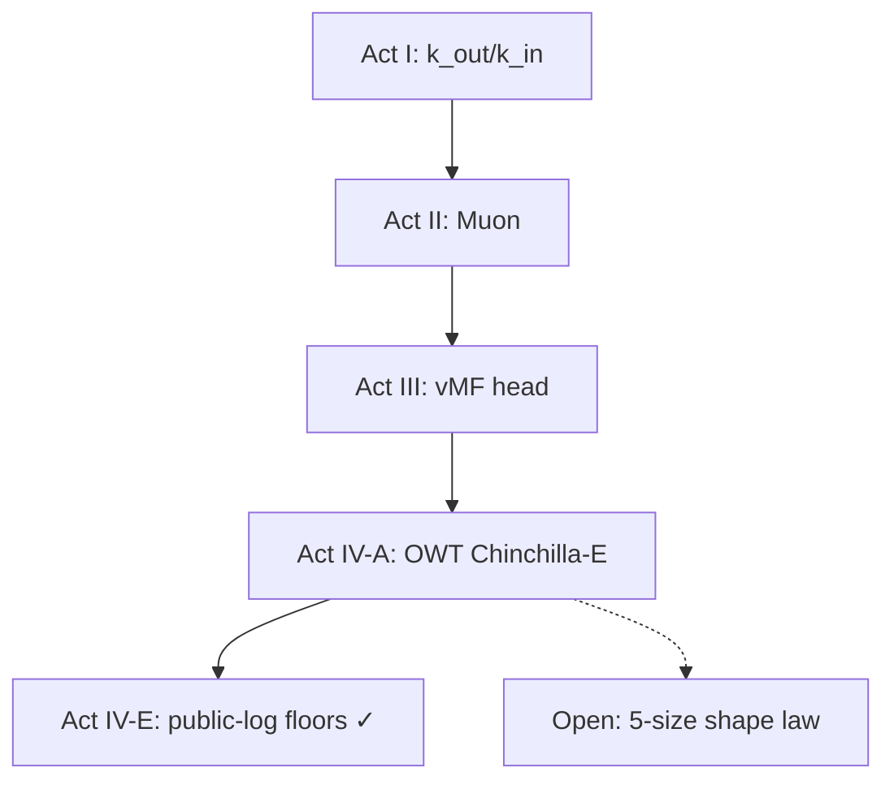

# Small Language Model Architecture Lab

**Repository:** [github.com/LNSHRIVAS/small-llm-lab](https://github.com/LNSHRIVAS/small-llm-lab)

[](requirements.txt)
[](docs/VERIFICATION.md)
[](LICENSE)
[](docs/PUBLICATION.md)

A **pre-registered falsification program** on custom small transformers (10M-51M parameters): factorized embeddings, Muon optimizers, spherical vMF heads, Chinchilla-E scaling on OpenWebText, and a **zero-GPU method** to recover corpus-specific irreducible-loss floors from public training ladders.

Every headline metric links to an executed log. Full narrative: **[`docs/PUBLICATION.md`](docs/PUBLICATION.md)** · Release checklist: **[`docs/PUBLISHING.md`](docs/PUBLISHING.md)**

---

## The discovery

**Not a new equation** - the Chinchilla separable ansatz is prior art. The result is a **portable instrument** that reads **corpus-specific irreducible training CE** from scaling ladders (public logs or small matched runs), with holdout/LOO gates that pass or fail for named reasons.

| Headline | Number | Source |
|----------|--------|--------|
| Pile: Pythia vs Cerebras (different stacks) | **1.482 vs 1.420** nats (Δ 0.06) | `results/floor_db/floor_db.csv` |
| Pythia holdout: small models → 6.9B loss | **Δ 0.003** nats | `results/robustness_chinchilla_e/` |
| Meta Step-2: five independent budgets | **σ ≈ 0.04** nats | `results/public_ladder_sweep/sweep_report.txt` |
| Public ladder sweep | **13 / 21 pass** | `results/floor_db/law_probes.txt` |

Floors are **corpus-specific**, not one universal constant (spread **1.52 nats** across passing corpora - law probes **reject** a single E_true).

**Full write-up (every claim → file):** **[`docs/FINAL_DISCOVERY.md`](docs/FINAL_DISCOVERY.md)**

---

## Thesis in one paragraph

I test architectural and scaling hypotheses with **quantitative gates declared before training**. The main architecture result is a head-only matched comparison at 9.96M parameters: a row-normalized vMF output head improves validation perplexity from **57.05 → 52.82** at epoch 2 (−7.4%) and rebalances gradient flow (head/body ratio **3.78× → 1.31×**).

The main scaling **method** result: you can recover a **corpus-specific irreducible-loss floor** cheaply from existing public model ladders, validated by holdout on **three independent corpus families** (Pythia/Pile, Meta Step-2, Kempner OLMo fineweb/smollm). This is **not** a claim that we measured Shannon entropy of text - it is a portable triangulation tool under the Chinchilla ansatz. Example estimates (α=0.34, uncertainty = LOO std): Pile **≈1.48 ± 0.06 nats** (6-size ladder), Step-2 **≈1.55-1.65 nats**, fineweb-edu **≈2.50 nats**, our trained OWT reference **≈2.5 nats**.

---

## Results at a glance

| Act | Question | Outcome | Primary metric |
|-----|----------|---------|----------------|
| **I** | Does `k_out` dominate `k_in`? | ✓ Confirmed | 11.2× marginal PPL efficiency; v16 test PPL **46.46** (pred 45.7±2) |
| **II** | Muon + SparseMuon? | ✓ Confirmed | Epoch-2 test PPL **48.93** (pred 48.3±2) |
| **III** | vMF vs softmax (matched)? | ✓ Confirmed | Epoch-2 val **57.05 → 52.82**; ep-8 test **39.20** |
| **IV-E** | Floor **method** from public logs? | ✓ **13/21 corpora** | Pythia + Step-2 + Kempner + OPT + Cerebras; failures diagnosed |
| **IV-A** | Chinchilla-E on OWT (trained)? | ✓ Confirmed | reference floor **≈2.5 nats**; PPL **43 / 39 / 31** |
| **IV-B** | β_rep ∝ √N? | ✗ Failed | Fitted **N^−0.084** |
| **IV-C** | A_floor ∝ V²/T? | ✗ Not supported | Protocol audit; corrected slope −0.25 |
| **Open** | Shared within-run shape law? | ? | Needs optional +2 OWT sizes - [`PREREGISTER_owt_6size_bounded_law.md`](docs/PREREGISTER_owt_6size_bounded_law.md) |

Detailed tables: [`docs/RESULTS.md`](docs/RESULTS.md) · Interpretation: [`docs/FINDINGS.md`](docs/FINDINGS.md)

---

## Two scaling threads (read separately)

| Thread | Status | Cost |
|--------|--------|------|
| **Corpus floor method** (IV-E) | **Done** - 13/21 corpora pass; FloorDB + law probes | CPU, ~3 min |
| **Within-run shape law** on OWT | **Open** - sharply pre-registered; one bounded experiment away | ~25-35 A100-h incremental |

Do not merge these claims. See [`docs/PUBLICATION.md` §5](docs/PUBLICATION.md).

---

## Quick start

### Zero GPU - log-only floor recovery (IV-E)

```bash
pip install numpy scipy pandas
python scripts/pythia_chinchilla_e_from_logs.py
python scripts/meta_step2_chinchilla_e_from_logs.py   # needs data/public_logs/meta_step2/
python scripts/chinchilla_e_robustness.py
python scripts/public_ladder_sweep.py
python scripts/floor_db.py --skip-sweep
```

Outputs: `results/pythia_chinchilla_from_logs/`, `results/meta_step2_chinchilla_from_logs/`, `results/robustness_chinchilla_e/`

### GPU - architecture & OWT (Acts I-IV-A)

```bash
pip install -r requirements.txt

# Act III: head-only vMF vs softmax
python scripts/v32_standard_softmax_comparison.py
python scripts/v41_vmf_concentrated.py --sota

# Act IV-A: Chinchilla-E on OpenWebText (~17.5 A100-h for 3 models)
python scripts/owt_chinchilla_e.py --prepare-data
python scripts/owt_chinchilla_e.py
```

Full guide: [`docs/REPRO.md`](docs/REPRO.md)

---

## Documentation

| Document | Purpose |
|----------|---------|
| **[`docs/FINAL_DISCOVERY.md`](docs/FINAL_DISCOVERY.md)** | Discovery framing + headline numbers (start here for the IV-E result) |
| **[`docs/PUBLICATION.md`](docs/PUBLICATION.md)** | Full research narrative (start here for deep read) |
| [`docs/LOG_ONLY_TRIANGULATION_RESULTS.md`](docs/LOG_ONLY_TRIANGULATION_RESULTS.md) | IV-E methods + numbers |
| [`docs/PUBLISHING.md`](docs/PUBLISHING.md) | GitHub release checklist |
| [`docs/README.md`](docs/README.md) | Index of all docs |
| [`docs/VERIFICATION.md`](docs/VERIFICATION.md) | Metric → source audit |

---

## Repository layout

```text
docs/                      Narrative, results, verification, publishing
scripts/                   Training + log-only triangulation
results/summaries/         act1-act4 JSON
results/pythia_*           IV-E outputs (committed)
results/meta_step2_*       IV-E outputs (committed)
data/public_logs/          Vendored public CSVs for standalone clone
archive/colab_runs/        Executed notebooks 01-08
colab/                     CPU/GPU validation notebooks
experiments/               triangulation.txt (Act IV audit)
```

`archive/internal/` is gitignored (supplementary research not in this release).

---

## Experiment arc



---

## Scope and limitations

- Floors are **corpus-specific model-data irreducible loss**, not Shannon entropy of text.
- IV-E is a **method/tool** validated by holdout - report estimates with LOO uncertainty, not false four-decimal precision from exact-fit.
- vMF is prior art; contribution is **matched measurement**, not inventing spherical heads.
- vMF changes **convergence trajectory**, not necessarily asymptotic floor.
- H1 Zipf-angle weak; H4 radial structure confirmed.
- β_rep and V²/T scaling rejected or unsupported after audit.

See [`docs/FINDINGS.md`](docs/FINDINGS.md) and [`docs/LINEAGE.md`](docs/LINEAGE.md).

---

## License and citation

This repository is licensed under **[CC BY 4.0](LICENSE)** (Creative Commons Attribution 4.0 International).

You may use, adapt, and build on this work **including commercially**, provided you **cite** this repository. Minimum citation:

> Shrivas, L. (2026). *Small Language Model Architecture Lab*. https://github.com/LNSHRIVAS/small-llm-lab

BibTeX and machine-readable metadata: [`CITATION.cff`](CITATION.cff)
