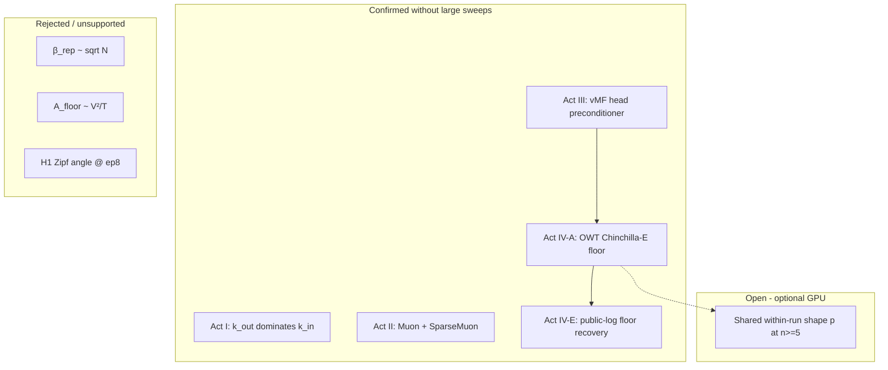

# Publication narrative  -  Small Language Model Architecture Lab

This document is the **GitHub-facing research story**: what was done, what was found, what failed, and how each claim is backed. It is written for reviewers, hiring managers, and collaborators who will not read fifty notebook cells.

Shorter tables live in [`RESULTS.md`](RESULTS.md). Interpretation and limits in [`FINDINGS.md`](FINDINGS.md). Audit trail in [`VERIFICATION.md`](VERIFICATION.md). Step-by-step reproduction in [`REPRO.md`](REPRO.md). GitHub release checklist in [`PUBLISHING.md`](PUBLISHING.md).

---

## Abstract

I ran a **pre-registered falsification program** on custom small transformers (roughly 10M-51M parameters) on WikiText-103 and OpenWebText. The program spans four acts: factorized embedding geometry, optimizer stack, output-head architecture, and scaling-law probes.

The principal **architecture result** is a head-only matched comparison at 9.96M parameters: a row-normalized vMF output head improved validation perplexity from **57.05 to 52.82** at epoch 2 (7.4% reduction), rescued tail-token learning from epoch 1, and rebalanced gradient flow (head/body ratio **3.78× → 1.31×**).

The principal **scaling result** is twofold and should not be conflated:

1. **Confirmed (zero GPU):** corpus-specific irreducible loss floors can be recovered from **public training ladders** via fixed-α Chinchilla-E triangulation, with holdout validation on Pythia/The Pile and Meta Step-2.
2. **Open (GPU sweep):** whether a **shared within-run decay shape** \( \mathrm{CE} = C_\infty(N) + (H - C_\infty(N))(1 + t/\tau)^{-p} \) simultaneously locks the triangulated OWT floor at n≥5 sizes.

I report negative outcomes with the same rigor: β_rep ∝ √N failed; A_floor ∝ V²/T is not supported after protocol audit; Zipf-angle hypothesis H1 was weak at epoch 8.

---

## 1. Research design

### 1.1 Pre-registration before training

Each act began with a written hypothesis, a quantitative prediction, and a pass/fail gate **before** the expensive GPU run. Examples:

| Act | Pre-registered prediction | Gate |
|-----|--------------------------|------|
| I (v16) | Epoch-2 test PPL **45.7 ± 2** at k_in = k_out = 96 | Inside band |
| II (v31) | Epoch-2 test PPL **48.3 ± 2** with Muon + SparseMuon | Inside band |
| III (vMF) | Faster convergence vs softmax at matched params | Δ val PPL @ ep2 |
| IV-A (OWT) | E_true in band **2.485-2.855 nats** | Triangulation + PPL ladder |

When a gate fails, I record the failure. When a protocol is invalid, I audit and retract  -  the original V²/T “falsification” at slope +0.183 was withdrawn after discovering fixed token budgets across T variants.

### 1.2 Evidence hierarchy

Every headline number in this repository traces to one of:

- Executed Colab notebooks `archive/colab_runs/01`-`08` (historical record)
- JSON summaries in `results/summaries/`
- Reproducible scripts in `scripts/`
- CPU validation outputs in `results/pythia_chinchilla_from_logs/`, `results/meta_step2_chinchilla_from_logs/`, etc.

Cross-checks are documented in [`VERIFICATION.md`](VERIFICATION.md). I do not treat markdown alone as evidence.

### 1.3 What this repository is not

- Not a universal “one number” for text entropy across corpora.
- Not a claim that vMF changes the asymptotic loss floor (trajectory vs floor).
- Not the full private ablation grid (~40+ version lines); see [`LINEAGE.md`](LINEAGE.md).
- Not a separate unpublished meta-analysis manuscript under review.

---

## 2. Act I  -  Embedding geometry (E4 factorization)

**Question:** At fixed depth and width, does output embedding width (`k_out`) dominate input width (`k_in`) for perplexity?

**Protocol:** Eight layers, d_model = 192, factorized embeddings (E4), two epochs, AdamW-family optimizers.

**Finding:** From marginal rates across v13-v15, one `k_out` dimension yields **11.2×** more perplexity improvement per dimension than one `k_in` dimension (0.201 vs 0.018 PPL/dim).

**Boundary test (v16):** k_in = k_out = 96. Pre-registered test PPL **45.7 ± 2**; observed **46.46** (confirmed). Naive linear extrapolation to 43.77 was rejected  -  the optimum sits in a **boundary region**, not at a sharp interior point.

**Artifacts:** notebooks `01`-`04`; [`act1_embedding_geometry.json`](../results/summaries/act1_embedding_geometry.json).

---

## 3. Act II  -  Optimizer stack (Muon + SparseMuon)

**Question:** Does the v31 Muon + per-row SparseMuon stack beat the AdamW-only baseline at matched architecture?

**Protocol:** Eight layers, d = 224, k = 48, vMF head, **9,958,162** parameters, WikiText-103, two epochs.

**Finding:** Epoch-2 test PPL **48.93** (gate 48.3 ± 2: confirmed). Earlier private lines falsified v30 SGDR basin-hopping and showed v29 tangential SparseMuon did not exceed v31.

**Artifacts:** notebook `05`; [`act2_optimizer_stack.json`](../results/summaries/act2_optimizer_stack.json).

---

## 4. Act III  -  vMF head vs softmax (head-only matched)

**Question:** With architecture, data, and optimizer fixed, does replacing only the output head accelerate convergence?

**Protocol:** Identical 9.96M stack; sole change is `HEAD_MODE` (linear softmax vs row-normalized vMF).

### 4.1 Convergence

| Epoch | Softmax val | vMF val | Δ |
|------:|------------:|--------:|--:|
| 1 | 67.11 | **61.76** | −5.35 |
| 2 | 57.05 | **52.82** | −4.23 (−7.4%) |
| 8¹ |  -  | val **42.72**, test **39.20** |  -  |

¹ Extended vMF run (notebook `07`); matched-epoch claims use the v41 A/B pair.

### 4.2 Mechanism (measured, not assumed)

| Signal | Softmax | vMF |
|--------|--------:|----:|
| head/body grad ratio @ ep2 | **3.78×** | **1.31×** |
| tail CE (rank >30k) @ ep1 | **11.38** (> uniform) | **9.54** (< uniform) |

I interpret vMF as a **preconditioner**: it changes the path toward a body-determined floor, not necessarily the floor itself.

### 4.3 Zipf gates @ vMF epoch 8

| Gate | Result | Verdict |
|------|--------|---------|
| H1: angle ∝ −log rank | Pearson **0.23** (gate > 0.5) | Weak |
| H4: radial ‖A_out‖ vs rank | Pearson **0.96** | Confirmed |

**Artifacts:** notebooks `06`-`07`; [`act3_v32_head_comparison.json`](../results/summaries/act3_v32_head_comparison.json).

---

## 5. Act IV  -  Scaling and irreducible loss

Act IV splits into **three threads** that answer different questions.

### 5.1 IV-A  -  Chinchilla-E triangulation on OpenWebText (trained here)

**Question:** Under the Chinchilla ansatz \(E_{\mathrm{app}}(N) \approx E_{\mathrm{true}} + A N^{-\alpha}\), what is the OWT floor?

**Protocol:** Three matched softmax models (10M / 25M / 51M), GPT-2 tokenizer, **500M tokens/epoch × 6 epochs**, A100 40GB.

| Model | Params | E_app | OWT test PPL |
|-------|-------:|------:|-------------:|
| A | 10.2M | 4.14 nats | 43 |
| C | 25.1M | 3.70 nats | 39 |
| B | 51.0M | 3.44 nats | 31 |

**Triangulation:** E_true **2.486-2.532 nats** (α = 0.34 or free α ≈ 0.353); inside pre-registered band; fit residuals ±0.0000 on anchors.

**Cost:** ~**17.5 A100 GPU-hours** for all three models (see [`PUBLISHING.md`](PUBLISHING.md) budget table).

**Artifacts:** notebook `08`; [`Experiments/triangulation.txt`](../experiments/triangulation.txt); [`act4_scaling_laws.json`](../results/summaries/act4_scaling_laws.json).

### 5.2 IV-E  -  Log-only floor recovery (zero training) ★ headline addition

**Question:** If public model ladders already exist, can we estimate the corpus floor **without training anything**?

**Method:** Download published step-wise training losses → build pseudo-epoch \(C^*\) curves → triangulate \(E_{\mathrm{true}}\) with **fixed α = 0.34** → holdout + leave-one-out gates.

| Corpus | Source | E_true (α=0.34) | Holdout | LOO | Verdict |
|--------|--------|----------------:|---------|-----|---------|
| The Pile | Pythia 70M-410M TSVs | **1.29 nats** | Δ=0.079 | std=0.144 | **Pass** |
| Meta Step-2 | Public scaling CSVs | **1.65 nats** | Δ=0.024 | std=0.067 | **Pass** |
| OpenWebText | Act IV-A (our runs) | **2.49 nats** |  -  |  -  | Reference |
| Dolma / OLMo | Partial public logs | ~2.19 | fail | fail | Truncated 13B log |

**Synthetic pipeline check (Colab):** known Zipf \(H = 5.640\) nats → recovered **5.638** nats (|Δ| = 0.002).

**Interpretation:** The irreducible floor is **corpus-specific**, not universal. Three independent lines (Pythia ~1.3, Step-2/MassiveText-scale ~1.7, OWT ~2.5) agree on “different corpora → different floors,” not on a single global constant. Failures track **preconditions** (truncated logs, free-α bound hits), not noise.

**Cost:** CPU, ~1 minute after log cache.

**Full write-up:** [`LOG_ONLY_TRIANGULATION_RESULTS.md`](LOG_ONLY_TRIANGULATION_RESULTS.md).

```bash
python scripts/pythia_chinchilla_e_from_logs.py
python scripts/meta_step2_chinchilla_e_from_logs.py
python scripts/chinchilla_e_robustness.py
```

### 5.3 IV-B / IV-C  -  Rejected or unsupported scaling forms

| Hypothesis | Outcome |
|------------|---------|
| β_rep ∝ √N | **Failed**  -  fitted **N^−0.084**, not N^0.5 |
| A_floor ∝ V²/T | **Not supported**  -  original +0.183 slope: invalid protocol; corrected −0.25 with flat A vs varying V²/T |
| C* = H + c·(V²/T) | **Falsified**  -  +0.85 nats deviation by epoch 8 |

### 5.4 Open thread  -  Universal within-run shape (optional GPU sweep)

Separate from IV-E. At **n = 3** OWT models, shared decay exponent \(p \approx 0.93\) fits nearly as well as free per-size \(p\) (ΔR² ≈ 0.003), but recovering the triangulated floor under fixed shared \(p\) drifts to **2.744** vs **2.485** (+0.26 nats). Three points cannot separate “universal shape” from “where is the floor.”

**Pre-registered resolution:** train **two additional sizes** (≈100M + ≈250M; 5 total) with the Act IV protocol; confirm if shared-p ΔR² < 0.01 **and** recovered E_true ∈ [2.39, 2.58]. Estimated **~25-35 extra A100-hours** (you already have the first three models).

Gates: [`PREREGISTER_owt_6size_bounded_law.md`](PREREGISTER_owt_6size_bounded_law.md).

---

## 6. Conceptual map



---

## 7. Repository map for readers

| Path | Purpose |
|------|---------|
| [`README.md`](../README.md) | Landing page  -  start here |
| [`docs/PUBLICATION.md`](PUBLICATION.md) | This narrative |
| [`docs/RESULTS.md`](RESULTS.md) | All numbers, tabulated |
| [`docs/FINDINGS.md`](FINDINGS.md) | Claims, limits, corrections |
| [`docs/LOG_ONLY_TRIANGULATION_RESULTS.md`](LOG_ONLY_TRIANGULATION_RESULTS.md) | IV-E deep dive |
| [`docs/VERIFICATION.md`](VERIFICATION.md) | Metric → source audit |
| [`docs/REPRO.md`](REPRO.md) | How to rerun |
| [`docs/PUBLISHING.md`](PUBLISHING.md) | GitHub release checklist |
| [`scripts/`](../scripts/) | Local reproduction |
| [`archive/colab_runs/`](../archive/colab_runs/) | Executed notebooks 01-08 |
| [`results/summaries/`](../results/summaries/) | Machine-readable act JSON |
| [`results/pythia_chinchilla_from_logs/`](../results/pythia_chinchilla_from_logs/) | IV-E Pythia outputs |
| [`results/meta_step2_chinchilla_from_logs/`](../results/meta_step2_chinchilla_from_logs/) | IV-E Step-2 outputs |
| [`colab/`](../colab/) | CPU/GPU notebooks for validation |

Supplementary bounded-law investigations live under `archive/internal/` (gitignored) and are not part of this public release narrative.

---

## 8. Suggested reading order

1. [`README.md`](../README.md)  -  5-minute overview  
2. **This document**  -  full story  
3. [`LOG_ONLY_TRIANGULATION_RESULTS.md`](LOG_ONLY_TRIANGULATION_RESULTS.md)  -  if you care about zero-GPU floor recovery  
4. [`RESULTS.md`](RESULTS.md)  -  if you need exact tables  
5. [`VERIFICATION.md`](VERIFICATION.md)  -  if you audit provenance  
6. [`REPRO.md`](REPRO.md)  -  if you rerun  

---

## 9. How to cite this work

```bibtex
@misc{small-lm-lab-2026,
  title  = {Small Language Model Architecture Lab: Pre-registered Falsification and Log-Only Scaling Floors},
  author = {[Your Name]},
  year   = {2026},
  url    = {https://github.com/LNSHRIVAS/small-lm-lab}
}
```

Replace author and URL before publishing.

---

## 10. Limitations (explicit)

- WikiText-103 and OpenWebText are **English web text**; floors and architecture conclusions may not transfer.
- vMF prior art exists; my contribution is **matched measurement** at 9.96M params, not invention of spherical heads.
- Log-only triangulation estimates **model-corpus irreducible CE**, not Shannon entropy of raw bytes.
- Free-α fits on real ladders often hit optimizer bounds; primary cross-corpus comparisons use **α = 0.34**.
- Extended bounded-law and θ-loop work is archived locally and not peer-reviewed in this release.

---

## 11. Contact and contribution

Issues and PRs welcome for reproduction fixes, additional public-log corpora, and documentation clarity. Do not open PRs that expand scope into unrelated architecture ablations  -  this repo is a **curated public subset** of a larger program.

License: MIT (see [`LICENSE`](../LICENSE) if present; add before first public push).
